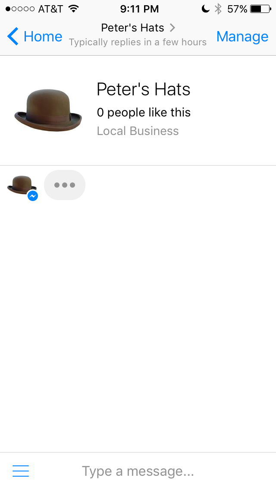
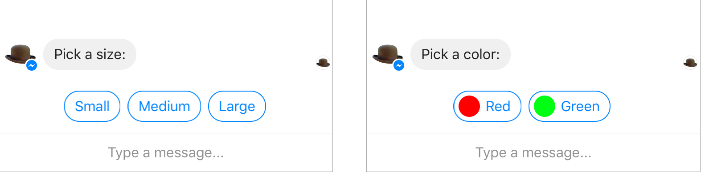
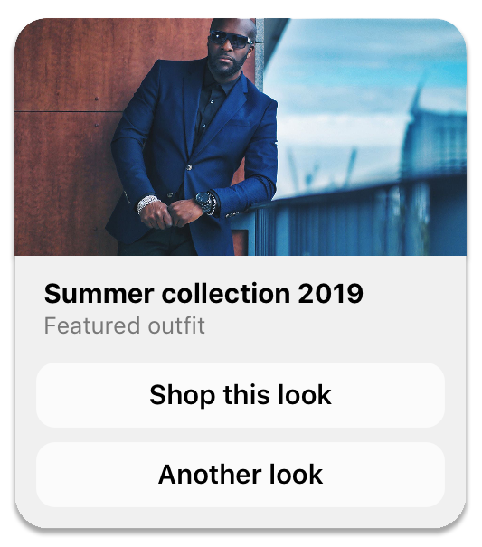
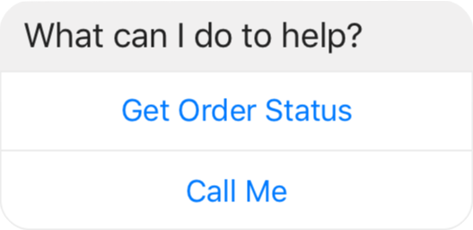
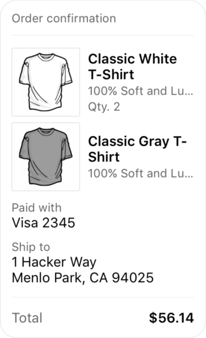
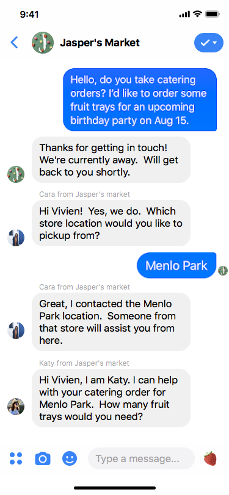
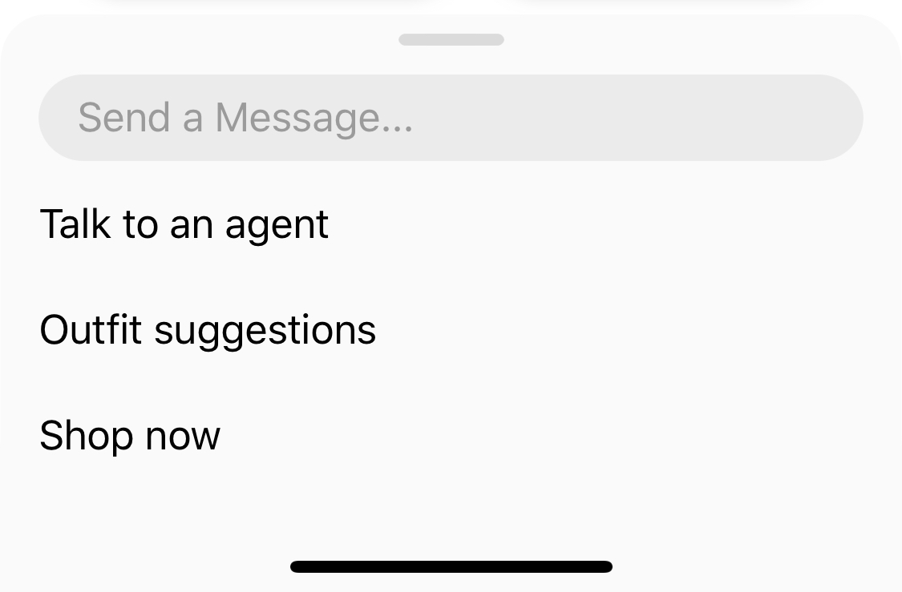
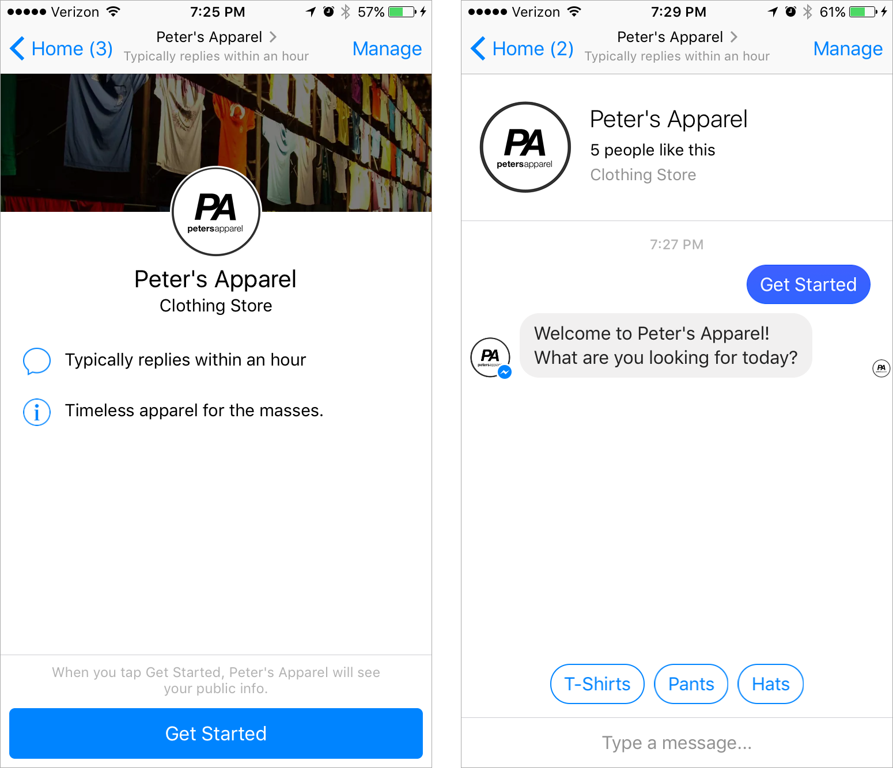

# Facebook Messenger Bot

A Nodejs library streamlining the integration and smooth utilization of the Messenger API for the development of interactive chatbots.

# Getting Started

## Installation

It is better to use npm :

```bash
npm install bot-messenger-bot
```

# Usage


## Create a Messenger instance

```javascript

const { Messenger } = require('bot-messenger-node');

const messenger = Messenger.create('<PAGE_TOKEN>');
```

## Send text message to user

```javascript
messenger.sendMessage('<USER_ID>', 'Hello world');
```

## Set action status



```javascript
const { Messenger, ActionType } = require('bot-messenger-node');

const messenger = Messenger.create('<PAGE_TOKEN>');

// Mark seen last message
messenger.setActionStatus('<USER_ID>', ActionType.MARK_SEEN);
// Set typing on
messenger.setActionStatus('<USER_ID>', ActionType.TYPING_ON);
// Set typing off
messenger.setActionStatus('<USER_ID>', ActionType.TYPING_OFF);

```

See [here](https://developers.facebook.com/docs/messenger-platform/send-messages/sender-actions) for best practice.

## Send message with quick reply



```javascript
const { Messenger, Message, QuickReply, Text, UserEmail, UserPhoneNumber } = require('bot-messenger-node');

const messenger = Messenger.create('<PAGE_TOKEN>');
const message = new Message("Pick a size:");

message.setQuickReplies([
    new Text("Small", "YOUR_PAYLOAD", "https://image.com"),
    new Text("Medium", "YOUR_PAYLOD"), // image url can be null
    // You can use UserPhoneNumber and UserEmail to detect automatically these values
    new UserPhoneNumber(),
    new UserEmail(),
]);

messenger.sendMessage('<USER_ID>', message);

```

## Send Template Message

### Generic Template



```javascript
const { Messenger, Message, Generic, GenericElement } = require('bot-messenger-node');

const messenger = Messenger.create('<PAGE_TOKEN>');

// Cannot exceed 10 GenericElement
const genericElements = [
    new GenericElement(
        "Summer collection 2019",
        "Featured outfit",
        "https://myimage.com/image.png"
    ),
    new GenericElement(
        "Other title",
        "I don't know",
        "https://myimage.com/image2.png" // image url can be null
    )
];

const template = new Generic(genericElements);
const message = new Message(template);

// You add quick reply if needed
// message.addQuickReply(...);

messenger.sendMessage('<recipient>', message);

```

### Button Template



```javascript
const { Messenger, Message, Button, PhoneNumber, Postback, WebUrl } = require('bot-messenger-node');

const messenger = Messenger.create('<PAGE_TOKEN>');
const button = new Button("What can I do to help?",
    [
        new Postback("Get Order Status", "YOUR_PAYLOaD"),
        new PhoneNumber("Call Me", "+261340226111"),
        // Button can be WebUrl
        new WebUrl("Go to my site", "https://mysupersite.com")
    ]
);

const message = new Message(button);

// You add quick reply if needed
// message.addQuickReply(...);

messenger.sendMessage('<recipient>', message);
```

### Media Template

 

```javascript
const { Messenger, Message, Media, Postback } = require('bot-messenger-node');

const messenger = Messenger.create('<PAGE_TOKEN>');

const media = new Media(Media.TYPE_IMAGE, '<attachment_id or facebook url>', [
    new Postback("I want some!")
    // 3 button max or []
]);

// Just change Media.TYPE_VIDEO for video media

const message = new Message(media);

// You add quick reply if needed
// message.addQuickReply(...);

messenger.sendMessage('<recipient>', message);

```

### Receipt Template



```javascript
const { Messenger, Message, Receipt, Address, Summary, Adjustment, RecieptElement } = require('bot-messenger-node');

const messenger = Messenger.create('<PAGE_TOKEN>');

const receiptElements = [
    new RecieptElement("Classic White T-Shirt", 450, "100% Soft and Lu..", 2, "USD", "https://image.com/withe.png"),
    new RecieptElement("Classic Gray T-Shirt", 600, "100% Soft and Lu..", 1, "USD", "https://image.com/gray.png"),
];

const summary = new Summary(56.14);
const receipt = new Receipt("Laza Niaina", "N°001", "USD", "VISA 1232135", receiptElements, summary);

// Adjustment and Address are optional; you can skip them if not needed
const adjustment = [
    new Adjustment("Transportation costs", 20),
    new Adjustment("Bus transport costs", 5)
];
const address = new Address("Miami", "city name", 20012, "State", "Madagascar", "SecondStreet or Null");
receipt.setAdjustments(adjustment);
receipt.setAddress(address);

const message = new Message(receipt);

messenger.sendMessage('<USER_ID>', message);

```

## File, Image, Video, Audio Attachment

```javascript
const { Messenger, Image, File, Audio, Video, Message } = require('bot-messenger-node');

const messenger = Messenger.create('<PAGE_TOKEN>');

// Image

// Local file
const image = new Image('./image.png');
// or remoteFile
const image = new Image('https://image.com/laza.png');

// I don't write in the following code the file remote from others because Image, File, Audio, Video supports a remote file
// Note that it is better to use a local file

// File
const file = new File('./myfile.txt');

// Audio
const audio = new Audio('./mysong.mp3');

// Video
const video = new Video('./myvideo.mp4');

const message = new Message(image); // You can change image to file, audio, video

messenger.sendMessage('<USER_ID>', message);


```

## Personas



### Personas management

```javascript
const { Messenger, Personas } = require('bot-messenger-node');

const messenger = Messenger.create('<PAGE_TOKEN>');

// Add personas

const personas = new Personas('Laza', 'https://image.com/profile.png');
messenger.addPersonas(personas).then(personasArray => {
  // if successful, personasArray will contain the personas's id
  console.log(personasArray);

  // Get one personas info
  messenger.getPersonas('<PERSONAS_ID>').then(personaInfo => {
    console.log(personaInfo);

    // Get All personas, this will return an array Personas[]
    messenger.getAllPersonas().then(allPersonas => {
      console.log(allPersonas);

      // Delete personas
      messenger.deletePersonas('<PERSONAS_ID>').then(deletionResult => {
        console.log(deletionResult);
      }).catch(error => {
        console.error(error);
      });
    }).catch(error => {
      console.error(error);
    });
  }).catch(error => {
    console.error(error);
  });
}).catch(error => {
  console.error(error);
});


```

### Personas Usage

```javascript
const { Messenger } = require('bot-messenger-node');

const messenger = Messenger.create('<PAGE_TOKEN>');

// Just by specifying in the third argument the id of the personas
// You can also use in Attachment type
messenger.sendMessage('<USER_ID>', 'Hello', '<PERSONAS_ID>');

```

## Messenger Options

### Persistent Menu



```javascript
const { Messenger, PersistentMenu, PersistentElement, Postback, WebUrl, MessengerAndroidLocales } = require('bot-messenger-node');

const elements = [
    // This is used by default if the language is not defined on the list
    new PersistentElement(
        [
            new Postback("Talk To an Agent", "YOUR_PAYLOAD"),
            new Postback("Outfit suggestions", "YOUR_PAYLOAD"),
            new WebUrl("Shop now", "https://ourwebsite.com"),
            // ...
        ],
        MessengerAndroidLocales.DEFAULT
    ),
    // This is used if the language is French
    new PersistentElement(
        [
            new Postback("Parler à un agent", "YOUR_PAYLOAD"),
            new Postback("Suggestions de tenues", "YOUR_PAYLOAD"),
            new WebUrl("Acheter maintenant", "https://ourwebsite.com/fr"),
            // ...
        ],
        MessengerAndroidLocales.FR_FR
    ),
    // See more in MessengerAndroidLocales or MessengerLocales
];

const persistentMenu = new PersistentMenu(elements);

messenger.setMessengerOptions(persistentMenu);

```

### Greeting

You can personalize the greeting text using the person's name. You can use the following template strings:

- `{{user_first_name}}`
- `{{user_last_name}}`
- `{{user_full_name}}`

```javascript
const { Messenger } = require('bot-messenger-node'); 

const messenger = Messenger.create('<PAGE_TOKEN>');

const elements = [
  // Default
  new GreetingElement('Welcome to my super page {{user_full_name}}'),
  // French Language
  new GreetingElement('Bienvenue sur ma super page {{user_full_name}}', MessengerAndroidLocales.FR_FR),
  // Spanish Language
  new GreetingElement('Bienvenido a mi súper página {{user_full_name}}', MessengerAndroidLocales.ES_ES),
  // et plus encore...
];

const greeting = new Greeting(elements);
messenger.setMessengerOptions(greeting);

```

### Get Started Button



```javascript
const { Messenger, GetStarted } = require('bot-messenger-node');

const messenger = Messenger.create('<PAGE_TOKEN>');

const getStarted = new GetStarted('YOUR_PAYLOAD');

messenger.setMessengerOptions(getStarted);

```

# Support

If you think there is an actual problem in this library, please [open](https://github.com/laza-niaina/bot-messenger-node/issues/new) an issue if there isn't one already created.

## Author
Laza Niaina
[lazaniaina13@gmail.com](mailto:lazaniaina13@gmail.com)
[Facebook](https://www.facebook.com/lazaniaina.r)

# License

MIT
